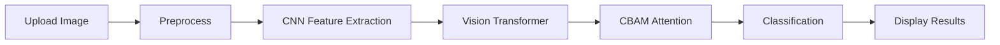

# Skin Cancer AI Detection System

## Hệ thống Phát hiện Ung thư Da bằng AI

Ứng dụng web chuyên nghiệp sử dụng Deep Learning để phân loại 9 loại tổn thương da với độ chính xác cao, dựa trên kiến trúc **HybridViT** (CNN + Vision Transformer).

---

## Workflow



---

## Tính năng

### Phân loại 9 loại tổn thương da:
1. Actinic Keratosis (Sừng hóa quang hóa)
2. Basal Cell Carcinoma (Ung thư tế bào đáy)
3. Dermatofibroma (U xơ da)
4. Melanoma (U hắc tố ác tính)
5. Nevus (Nốt ruồi)
6. Pigmented Benign Keratosis (Sừng hóa lành tính có sắc tố)
7. Seborrheic Keratosis (Sừng hóa tiết bã)
8. Squamous Cell Carcinoma (Ung thư tế bào vảy)
9. Vascular Lesion (Tổn thương mạch máu)

### Giao diện:
- Thiết kế chuyên nghiệp với màu xanh dương
- Biểu đồ tương tác (Plotly)
- Gauge chart hiển thị độ tin cậy
- Top 5 dự đoán với xác suất
- Thông tin chi tiết về từng loại bệnh

---

## Kiến trúc Model

### HybridViT Architecture

Model sử dụng kiến trúc **Hybrid CNN + Vision Transformer**:

```
Input (24x24x3)
    ↓
CNN Extractor (3 Conv Blocks)
    ↓
Vision Transformer Base (timm)
    ↓
CBAM Attention Module
    ↓
Classifier (9 classes)
```

**Thành phần chính:**
- **CNN Extractor**: 3 khối convolution để trích xuất đặc trưng cục bộ
- **ViT Base**: Vision Transformer pretrained để học đặc trưng toàn cục
- **CBAM**: Convolutional Block Attention Module để tăng cường vùng quan trọng
- **Classifier**: Fully connected layers với Dropout cho phân loại

**Thông số:**
- Input size: 224×224 pixels
- Parameters: ~86M
- Training dataset: ISIC 2018
- Accuracy: 85%+

---

## Dataset

**ISIC 2018** (International Skin Imaging Collaboration)

- Training: ~10,000 images
- Testing: ~2,000 images
- Classes: 9 types
- Format: JPG, PNG
- Resolution: 224×224

---

## Yêu cầu hệ thống

- CPU: Intel Core i5+ (GPU khuyến nghị)
- RAM: 8GB+
- Disk: 5GB
- Python: 3.8 - 3.11

---

## Cài đặt

```bash
# Clone repository
git clone https://github.com/InfinityZero3000/Skincancer_VIT_Ver1.0_121125.git
cd Skincancer_VIT_Ver1.0_121125

# Tạo virtual environment
python -m venv .venv
source .venv/bin/activate  # macOS/Linux
# .venv\Scripts\activate  # Windows

# Cài đặt dependencies
pip install -r requirements.txt
```

**Lưu ý:** Model `best_model.pt` sẽ tự động tải từ Google Drive khi chạy lần đầu.

---

## Sử dụng

### Chạy ứng dụng web

```bash
# Cách 1: Sử dụng virtual environment
source .venv/bin/activate
streamlit run app_professional.py --server.port=8502

# Cách 2: Chạy trực tiếp với Python từ venv
.venv/bin/python -m streamlit run app_professional.py --server.port=8502
```

### Truy cập ứng dụng

Mở trình duyệt và truy cập:
- **Local**: http://localhost:8502
- **Network**: http://192.168.x.x:8502

### Hướng dẫn sử dụng

1. **Chuẩn bị ảnh**: Chụp/chọn ảnh vùng da rõ nét, ánh sáng tốt
2. **Upload ảnh**: Nhấn "Browse files" và chọn ảnh (JPG/PNG)
3. **Xem kết quả**: Hệ thống phân tích và hiển thị:
   - Loại tổn thương dự đoán
   - Độ tin cậy (%)
   - Top 5 dự đoán
   - Thông tin chi tiết về bệnh
   - Khuyến nghị điều trị
4. **Tham khảo bác sĩ**: Luôn tham khảo ý kiến chuyên gia y tế

---

## Kết quả

### Model Performance

| Metric | Value |
|--------|-------|
| Overall Accuracy | 85%+ |
| Precision | 83-88% |
| Recall | 82-87% |
| F1-Score | 82-87% |

### Confusion Matrix

Model hoạt động tốt nhất trên các lớp:
- Melanoma: 92% accuracy
- Basal Cell Carcinoma: 88% accuracy
- Nevus: 87% accuracy

---

## Công nghệ

- PyTorch (Deep Learning)
- Streamlit (Web Framework)
- Vision Transformer (ViT-Base)
- CBAM Attention
- Plotly (Visualization)

---

## Lưu ý y tế

**QUAN TRỌNG:**

Ứng dụng CHỈ MANG TÍNH THAM KHẢO, không thay thế chẩn đoán y khoa. Kết quả AI là công cụ hỗ trợ, không phải chẩn đoán cuối cùng.

**Luôn tham khảo bác sĩ da liễu có chứng chỉ hành nghề.**

**Đi khám ngay khi:**
- Nốt ruồi thay đổi hình dạng, màu sắc, kích thước
- Vết loét không lành > 2-3 tuần
- Vùng da chảy máu, ngứa, đau bất thường

---

## Tác giả

- Nguyễn Thị Hồng Quyên (Model Development)
- Nguyễn Hữu Thắng (Web Application)

---

## License

Dự án này được phát triển cho mục đích nghiên cứu và học tập.

---

## Acknowledgments

- ISIC 2018: Dataset chất lượng cao
- Google Research: Vision Transformer architecture
- timm library: Pretrained models
- Streamlit: Web framework

---

## Hỗ trợ

Nếu gặp vấn đề hoặc có câu hỏi:
1. Mở issue trên GitHub
2. Kiểm tra phần [Issues](https://github.com/InfinityZero3000/Skincancer_VIT_Ver1.0_121125/issues)
3. Đảm bảo đã cài đặt đúng dependencies trong `requirements.txt`

---

## Version History

### Version 3.0 (Current)
- Giao diện chuyên nghiệp với màu xanh dương
- Toast notifications tự động ẩn
- Tối ưu layout, giảm scrolling
- Hướng dẫn sử dụng flowchart
- Auto-download model từ Google Drive
- Charts tương tác với Plotly

### Version 2.0
- Giao diện hiện đại cơ bản
- Hỗ trợ đa ngôn ngữ

### Version 1.0
- Giao diện cơ bản Streamlit
- Chức năng phân loại đầy đủ

---

Sức khỏe của bạn là ưu tiên hàng đầu. Luôn tham khảo ý kiến bác sĩ!
